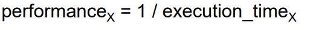

# 중간

2주 1차시

**프로세서** : 컨트롤러+ 데이터패스

**ISA** 

하드웨어의 최상위단과 소프트웨어의 최하위단의 추상화된 interface

명령어,레지스터,메모리 접근, I/O 등의 기계어를 작성하는데 필요한 모든 정보를 가짐

******ABI******

ISA와 OS interface를 더한 것

user portion of the 명령어 set

시스템 인터페이스를 operating

Like API above OS

## Performance에 영향

- ****Algorithm****
    - 실행되는 number of operation 결정
- ********************************************************************************Programming language, compiler, architecture********************************************************************************
    - machine 명령어의 수를 결정
- ********************************Operating system********************************
- ******************************************************************************Processor, memory system and I/O system******************************************************************************

# 1장

### CPU time이 더 중요한 척도 than elapsed time

→ elapsed time은 I/O와 같이 device-dependent

**Response time vs. Throughput (p.71)**

- **Response time (execution time)**
    - 시작부터 task 완료까지
    - 사용자 관점
- **Throughput (bandwidth)**
    - 주어진 시간동안 완료되는 작업의 양
    - 시스템 관점
    - data center의 관리가 중요
    

embedded나 desktop에 따라 performance metric이 달라질 수 있음

### Defining Performance

performance를 최대화하기 위해선 execution time을 최소화해야함

X가 Y보다 n배 빠르다고 할 때

### Execution Time 측정

**Elapsed time**

전체 경과된 시간 (total reponse time, including processing, scheduling, i/o time,…)

System Performance를 정의함

**CPU time**

주어진 작업을 processing하는데 드는 시간

→      $clock\_cycle\_time = 1/clock\_rate$ (Time = 1/frequency)

→ **CPU time is more important than elapsed time.**

Execution time이 줄어들면 clock cycle이가 증가함??

number of **CPU clock cycles**

명령어마다 실행 시간이 달라서 평균으로

clock 수 = IC*CPI

**Clock cycles Per Instruction (CPI)**

프로그램의 IC

CPI(평균)

************************알고리즘 : IC에 영향,************************ CPI도 가능

**************************************언어 : IC에 영향,************************************** CPI도 가능

**컴파일러 : IC, CPI에 영향**

******************ISA : IC, CPI, clock cycle time에 영향******************

****Core organization : CPI, clock cycle time에 영향****

****************************************Technology : affects clock cycle time****************************************

같은 프로그램, 다른 CPU(ISA)면 IC, CPI, Clock cycle time(clock_rate)다름

다른 프로그램, 같은 CPU(ISA)면 IC 다르고, CPI, clock cycle time(clock_rate)같음

같은 프로그램,CPU, 다른 컴파일러 → IC 다르고, 평균 CPI바뀌나?

---

******ISA******

하드웨어 최상단과 소프트웨어 최하단을 연결해주는 추상화된 인터페이스

얼마나 컴파일러가 효율적으로 사용할지 (not programmers)

**단순함은 규칙성을 선호한다.**

고정 사이즈 명령어
**적은 수의 명령 형식**
opcode는 항상 처음 6비트입니다

**작은 것이 더 빠릅니다.**

제한된 명령 집합

레지스터 파일의 제한된 레지스터 수

제한된 주소 지정 모드 수

**common case를 빠르게**

레지스터 파일에서 operand 가져옴(메모리에서 X,load store system

명령어에 Immediate 피연산자를 포함시키다.

not을 nor로

**좋은 디자인은 좋은 타협을 요구한다.**

제한된 3가지 명령 형식

알고리즘은 operation 개수 결정

Programming language는 machine instruction의 수 결정

---

# ISA for MIPS (2장) 9월 21일

**서로 다른 컴퓨터(CPU)는 다른 ISA를 가짐**

- 유사한 측면도 다수

ISA가 복잡하면 하드웨어, 컴파일러 처리 과정도 복잡해짐

**Stored program (폰 노이만 von Neumann)**

- **메모리에 저장돼있는 명령어** 하나를 CPU가 가져가서 계산

 

**MIPS ISA**

- used by Broadcom, Cisco, 등
- **RISC philosophy**를 따름
    - 고정된 명령어 길이 (32bit = 4byte = 1word)
        - 명령어 가져오는 로직도 단순함
        - CISC는 명령어 길이 다양함
    - load-store 명령어만 메모리에 접근
        - RISC에서는 load, store 엄격하게 제한
    - addressing modes(주소 지정 방식) 종류 제한 - **5가지**
    - 연산(operation)의 개수에도 제한

**디자인 목표**

- **maximizing performance, minimizing cost**
- **reduce design time**
- **minimize memory space(**임베디드)
- **minimize power consumption**

**ISA의 효율성은 얼마나 컴파일러가 효율적으로 사용하는 지로 측정**

프로그래머가 효율적으로 사용하는 것은 아님

### 일반적 4가지 설계 원칙

- **정형적으로(regularity)설계하기 위해 단순하게**
- **작아야 더 faster**
- **common case를 더 빠르게**
    - 자주 사용하는 명령어를 빠르게해야 빨라지는 것
- **좋은 설계는 좋은 타협을 요구함**

### 설계의 두 가지 원칙

- **명령어나 데이터**는 **숫자**(i.e. 010110)로 이루어져 있고, 데이터와 **구분할 수 없음**
- 프로그램은 **alterable(변경 가능한) 메모리**에 저장되어있음 (데이터와 유사하게)

# MIPS-32 ISA

### MIPS에서 4가지 설계 원칙

- **정형적으로(regularity)설계하기 위해 단순하게**
    - **고정 사이즈 명령어** (i.e. 32bit)
    - 적은 수의 명령어 포맷 (R, I, J type 총 3가지)
    - 처음 6bit는 항상 명령어
- **작아야 더 faster**
    - 명령어 집합의 수가 적음(명령어 수)
    - register에 register file도 제한돼있음 (R0 ~ R31, +특수목적 레지스터
    - addressing mode(주소 지정 방식)이 제한되어 있음
- **common case를 더 빠르게**
    - 자주 사용하는 명령어를 빠르게해야 빨라지는 것
    - **register file에서 온 arithmetic 피연산자(**common case)
    → **위 operand로 load-store machine이라 불림
    →** 메모리에서 가져오면 안 됨
    - **작은 정수를 더하는 연산**이 많은 경향이 있음
        
        → register file까지 가지도 않고 16bit 이하? 즉각 연산 (**ADDi - Add immediately**
        
- **좋은 설계는 좋은 타협을 요구함**
    - 3가지의 명령어 format을 가짐 (최소화)

## MIPS Arithmetic Instruction

- 각 산술연산 명령어는 하나의 명령어 연산을 사용 - RISC
- 각 피연산**(operand)**는 **datapath의 register file**에 포함되어 있음
    
    →register file은 register를 모아둔 메모리
    → ex) $t0, $s1, $s2는 datapath 상에 존재
    
    CPU는 datapath와 control주체?이다????
    
    <aside>
    💡 **CPU
    - Control : processor controller는 명령어를 decode해서 datapath가 무엇을 해야하는 지 알려줌**
    
    - **Datapath : datapath의 operation은 processor의 controller에 의해 control 됨**
    
    </aside>
    

- Arithmetic Instruction은 **명령어 포맷 R**에 해당함

- **산술 연산의 opcode : 0**

 

## MIPS 명령어 필드 (R type)

레지스터 R0 ~ R31 : 32개

**op :** 6-bits, opcode

어떠한 operation인지 결정하는 field

**rs, rt, rd :** each 5-bits, regitser file address **source (2개), destination..**

I-type에서는 rt field가 register target임

**shamt :** 5-bits, shift amount (for shift instructions)

**funct :** 6-bits, function code   

opcode에 augmenting(덧붙여짐)

## MIPS 레지스터 파일

**레지스터 파일**

- 레지스터를 모아놓은 저장소 (R0 ~ R31) (32bit 레지스터 32개)

동시에 **두 개의 레지스터를 읽을 수 있고**, **하나의 레지스터에 쓸 수 있음 (read port, write port)**

- 메인 메모리보다 빠름
- 레지스터 크기를 키우면 느려짐 (32 locaton → 64, 50% slower)
- **read/write port**가 **증가**하면 **시스템**이 **복잡**하고, **느려짐**
- **스택을 사용하는 것 보다 컴파일러**가 사용하기 **쉬워짐**
    - ex) (A*B)-(C*D)-(E*F)에서 any order vs. stack

<aside>
💡 레지스터는 5bit로+ 접근 가능, memory는 32bit가 필요함 (addressing 시에 code density 향상)

</aside>

20분 

## MIPS 레지스터 convention

0,1은 사용 빈도가 높기 때문에 특성 레지스터는 해당 값을 가지도록 만들어둠

## 레지스터 vs. 메모리

**산술 연산 피연산자는 must be in registers**

## 프로세서 - 메모리 Interconnection

메모리

단순 1차원 배열

주소가 index 역할

 

4byte = 1 words, 1 word 단위로 읽고 쓰기를 함

location은 2^32 Bytes = 4 GB, 2^30 Words (1 GW)

## MIPS 메모리 접근 명령어 (I-type)

**I-type의 하위 16비트**

메모리 주소 offset

상수값 저장

branch target 저장

 

MIPS는 **load word(lw)**, **store word(sw)**라는 **data transfer** 기본 명령어가 존재

- 5-bit address로 load into or store from register
    - 레지스터는 총 32개가 있기 때문에 5비트만으로 addressing 가
- load word from memory
- store word to memory

memory base address 주소 **A**

offset value **B** → **A + B**

offset : 16bit

16-bit offset은 base 주소에서 위로 2^15개, 아래로 2^15개로 하여 접근

→ 그러면 메모리는 원래 2^30word 범위인데, 배열 길이에 한계가 있는건가? → A[8]이걸 배열로 생각하면 안되나?

## MIPS 메모리 Addressing

$s3의 경우 직접 주소가 아니라 포인터 처럼 간주되는 것 같음??

# 9월 28일

## Compiling with  Loads and Stores

## 가변 Array Index

index가 1 증가할 때마다 4씩 커짐 →

c = A[i] -b = 4*i +$s4 -b($s1)

더하기 연산자 2개를 이용하여 곱하기 연산자를 구현

대부분의 컴퓨터는 8-bit byte to represent characters

character는 ascii, 1byte 데이터를 옮길 때 store word, word는 4-byte

→ byte단위로 데이터를 이동해야할 필요가 있음

**Alignment restriction** 

메모리 주소 alignment 4의 배수로 정렬?

끝자리 0, 4, 8, 12..이 되길 희망 → 주소 레지스터 마지막 자리는 항상 00? 0000 0100 1000 1100

- **not-aligned format에서는?**
    
    한 word에 접근하기 위해 2개의 메모리 line을 접근해야할 수도 있음 → 비효율적
    

## Byte Addresses

### Little Endian

Intel, ARM, …

**시작 주소를 LSB로**

 작은 자릿수부터 쓰는 거

### Big Endian

MIPS, HP PA-RISC, …

**시작 주소를 MSB로**

큰 자릿수부터 쓰는 거(일상적으로 쓰는 순서)

## Loading and Storing ‘Bytes’

word 단위가 아니고 byte 단위이기 때문에

offset이 4의 배수일 필요 없음

byte = 8 biit,

$t0는 32bit 레지스터

<aside>
💡 register의 rightmost 8bit에 load되거나 rightmost 8bit가 memory의 특정 자리에 store됨

</aside>

<aside>
💡 other bit가 register에 있으면 zero-extend (or sign-extend은 안됨?????ㄹㅇ모르겠네)
메모리에 있는 other bit는 바뀌지 않

</aside>

앞에 24bit는? zero-extends, or 부호 고려

offset 6인 경우에는?

**MIPS에서 레지스터 0으로 초기화할때 add $s3, $zero, $zero 사용 ($zero, 0번 레지스터는 0 hard wired)**

## Loading and Storing ‘Half Words’

rightmost 16비트에 load하고 store, 나머지는 손 대지 않는다

 

### I-타입의 다른 목적

Small constants(작은 상수) 연산이 빈번히 사용됨

- 다수의 프로그램에서 연산의 50%정도를 차지 - Common case

**Solutions??**

자주 나오는 상수를 메모리에 저장해두고, load

레지스터 몇 개를 hard-wired해서 1,2,4,10,.. $zero처럼

상수를 명령어에 넣어두기?

### 상수 포함 명령어

명령어 안에 상수를 포함시키자 → much faster than loaded from memory

- instruction과 함께 따라옴

산술 연산을 위해 **sign extension**

### sign extension이 필요한 경우

- **I-format의 Immediate 값 확장**
    - immediate 명령어를 사용할 때 immediate 값을 32비트로 확장
- **Arithmetic Shift 연산**
    - sra과 같은 명령어로, 32비트로 확장하는데 사용
- **beq, bne와 같은 branch 명령어에서 distance를 32bit로 만드는데 사용**
    - beq, bne와 같은 branch에서 distance를 32비트로 만드는데
- **********lw, sw 시에 메모리 offset 확장을 위**********

→ sign extension은 원본 그대로의 값을 유지하는 특성, offset이나 산술 계산에 이용

### MIPS Immediate Instruction

16bit Immediate 포맷 limit 값은 2^15-1 to -2^15

<aside>
💡 **slti** = set less than immediate

</aside>

<aside>
💡 **subi** 명령은 없는데, 이 이유는
Adding 2’s complement는 subtract와 같은 동작임

</aside>

### Larger 상수를 load를 할 때에 대해서는?

**두 개의 instruction을 함께 사용**

**lui**(load upper immediate) **+ ori**

load는 원래 rightmost, 즉 하위에 n bit에 넣지만

load upper는 상위 n bit에 load

ori는 or immediate

상위 bit는 zero extension 이후 or연산

(Load를 안 쓰는 이유는, 아마 load하면 zero extension을 하여 저장하기 때문이 아닐까?)

---

## Shift 연산

### logical shift (sll, srl)

8-bit char/number/data를 32bit로 확장하거나 할 때(pack/unpack)

상수는 있지만, **R type format** (shamt 자리에 들어감)

shamt field는 5-bit로 충분, 2^5 = 32, 32bit만큼 이동할 수 있음

does not use rs field, 

### arithmetic shift

**sll (shift left logical)은 있지만, sla(shift left arithmetic)은 없음**

→ sra와 달리 **sla는 sll과 기능이 같음** (sLA 필요 없음)

sign bit가 shift되어 들어옴 (MSB bit가 shifted in됨)

### and/or/nor (bit-wise)

**AND**

masking할 때 사용

**OR**

bit를 추가할 때,

**NOR(NOT)**

invert bits

a NOR b == NOT(a OR b)

**0과 NOR하면 same as NOT operation**

NOT operation쓰는 것 보다 $zero를 사용하는 게 더 빠름

---

## Branch (Instructios for making decision) - I format

흐름(control flow)를 바꾸는

bne : branch not equal 같지 않으면 branch

beq : branch equal 같으면 branch

**label은 주소 값을 가지고 있는 것임(번지 기준 offset 얼마 더할 지에 대해)**

**Label field is immediate**

branch destination (주소, 16bit offset으로 나타냄)

 **16bit offset**는 used for **branch distance**(address)

I-type의 offset field의 사용예 (산술 계산)

- Memory address offset for lw & sw
- Immediate constant value (which is contained in instruction itself)
- Branch offset for target (branch distance)

→ **이 3가지 케이스는 sign extension을 필요로함**

---

10/7

### Branch offset details

pc = instruction address register (MIPS : 다음에 실행될 명령어 (pc+4))

**branch distance limit은 -2^15 to 2^15-1 instruction (word) -** 뒤에 두 자리 00이니깐 그 앞에부터 offset에 적어주면됨

branch offset에 32bit sign extension이후 pc와 계산

→매우 적은 추가적인 하드웨어 cost, and no impact on the clock cycle time

### In Support of other Branch Instruction

**Set on less than instruction - slt**

 

## (Pseudo) Implementation of more branch Instruction - (blt, ble, bgt, bge)

이거랑 달리 관계 beq bne 반대로 해야 if문 조건 수행하기 편한듯?

### 연습용

if(i<j)

h = i+j;

slt $at $s0 $s1

beq $at $zero Lb1

h = i+j

Lb1

if(i≤j)

h = i + j;

slt $at $s1 $s0

bne $sat $zero Lb1

h=i+j

Lb1

## Unconditional Jump

unconditional branch

j Lbl #go to Lb1

<aside>
💡 **if, while,switch → conditional branch 가 어쩔 수 없이 필요함(jump)**

</aside>

### J format

Jump 목적지 주소는 어떻게?

branch offset처럼 뒤에 00 (word 단위로 jump하니깐)

shift 두 칸 한 뒤에

branch처럼 더하고 뺴고가 아니라 **해당 주소로 가는 것** 

앞에 4비트는 제외하고 아래에는 override

→ 2^28 주소까지 jump 가능한 것

### 더 멀리 branch(Jump)할 때에는 Jump사용

branch할 때 16bit offset으로 못 갈 때에도 J type을 사용할 수 있음

대신 IC는 증가

<aside>
💡 common case를 빠르게 한 것들의 예는?

</aside>

 

Branch할 떄 offset 설정 부분에서

branch 조건이 true이면, PC에 result가 쓰여짐(다음 cycle 전에)

branch들어갈 때 PC는 다음 명령어를 가리키고 있음

따라서 Else까지의 offset은 add instruction을 기준으로 2가된다.

### Jump Register - jr

$t1 레지스터에 있는 값 (주소) 로 jump함

일반 jump는 pc에 offset을 override했지만, 

jr : jump register (register is 32bit) - R format

---

## 프로그래밍 스타일

**Procedures(함수)**는 

프로그램을 구조화하는데 도움을 줌

- 이해하고 debug하기 쉬움
- code를 재사용할 수 있게
- 특정 시점, 특정 부분에만 집중할 수 있게 ( 모듈화 )
    
    파라미터는 베리어 역할 procedure과 프로그램과 데이터 나머지 사이의
    

### **Caller, Callee**

main함수가 func a를 호출하면 → main이 **caller**, a가 **callee**

1. **Caller**가 파라미터를 **callee**가 접근할 수 있는 레지스터에 저장
    1. $a0 - $a3 : 4개의 argument 레지스터
2. **Caller**가 **callee**에게 제어권 넘김
3. **Callee** 는 필요한 저장 자원을 얻음
4. **Callee**가 task 수행 
5. **Callee**는 수행 결과를 **Caller**가 접근할 수 있는 레지스터에 저장
    1. $v0 ~ $v1까지 두 개의 value 레지스터
6. **Callee**는 **Caller**에게 제어권을 다시 넘겨줌
    1. 이때 **$ra 레지스터**를 이용하여 **원래 위치(돌아갈 주소)**를 알려줌

**Preserved on call**

함수 호출이 일어날때 양쪽에서 레지스터 쓸 수 있는데, 건드릴 때 **보관**해야 하느냐 안 해야 하느냐에 대해

**yes** : (**callee-saved**, 사용하고 원래 값으로 복구해서 돌려줌???)

**no** : (**caller-saved**, 호출자가 저장해야함, 복원해서 써야함)

→ $t레지스터를 사용해야 할 경우에도 위처럼 호출자가 저장

저장해둔 뒤 다른 함수 호출하는 개념임

- $s 레지스터를 사용할 떄는 값을 stack에 넣어놓든 해야함

---

### 명령어 관점에서는

**jump and link**

**$ra**는 **복귀주소**를 가지고 있는 **레지스터**

1. **PC + 4**를 **$ra**에 저장 — **link**
2. **ProcedureAddress**로 **Jump — jump**

돌아올 때는

**jump and return**

**$ra**가 붙어서 들어감 (31) rs field만 쓰는듯?

---

### 최대공약수 함수를 실행하는 상황의 예

1. gcd(i, j);
2. **Caller**는 **i**와 **j**를 argument register **$a0**와 **$a1**에 넣어줌
3. jal gcd #jump and link, set $ra = PC+4, jump
4. **callee**는 gcd 수행 후, 결과를 $v0에 넣고, caller를 jr을 사용하여 control을 return함
5. jr $ra

### 만약 callee가 $a 레지스터 외에 더 필요하다면

ex) 4 arguments  and 2 return value가 필요한 상황

**callee**는 **메모리의 stack**을 사용함

**$sp**는 **stack**의 **top**을 가리키는데

high addr부터 low addr로 grow to lower address

→ 그래서 파라미터의 수가 증가하면 execution time이 증가함

### 종단 함수 예시

addi 2word를 위한 공간 마련

$t레지스터는 굳이  preserved on call no라서 callee가 저장할 필요는 없지만 예시를 위해 한듯

$s가 아래와 같이 해야하는 레지스터

### Stack

******Procedure frame******이나 ********************************************activation record********************************************라고 불림

$fp와 $sp 사이를 해당 함수 범위를 나타내는 기준

$fp는 **base(거꾸로 자라니깐?),** $sp는 top

**Saved arguement registers(if any)**

**Saved return address**

**Saved Register (if any)**

$fp가 저장됨,  이전의 stack top으로 돌아가기 위해

**Local 변수** 

위 상황에서 i+j를 k 로컬 변수에 저장할 수도 있으니깐?

**$fp**

**first word** of the 함수의 프레임을 가리킴, base register

함수 호출될 떄 **$sp**를 이용하여 초기화됨 ($fp = $sp)

restore될 때는 $fp로 **$sp**를 초기화

함수의 local 변수와 레지스터를 가지고 있음 

→ procedure frame, activation record 라고 함

**local 변수가 push되면**

$sp를 update해야함 (stack 증가하니깐)

---

## $gp (global pointer - static, dynamic data)

**상수**나 **배열**, **전역변수**과 같은 static data segment는 static data에 저장됨($gp가 마지막 주소를 가리킴)

**$gp**는 static data address의 마지막 주소(최상단)를 가리키고 있음

 동시에 heap의 base 주소, (최하단), stack과는 반대로 자라니깐

## MIPS 명령어 분포

common case는 뭔지, 

---

## Addressing Mode (주소 지정 모드) 5가지

메모리에서 데이터,명령어를 가지고 올 때 어디에 있는지 지정을 해줘야함, 어떻게 접근할 지 명세

## Data addressing

- 이 **명령어**의 **피연산자의 value**를 찾는 방법

### Immediate addressing

상수는 명령어에 포함되어 있음

ex) immediate instruction

### Register addressing

피연산자는 레지스터에 가면 있음

### Base(변위) addressing

base register에 offset만큼 더하여 **메모리**에 접근

ex) load/store 명령

rs : **base**

**offset**

<aside>
💡 **피연산자가 있는 곳**

- 레지스터
- 메모리
- 명령어 자체에
</aside>

## Instruction addressing

- **다음 실행할 명령어**가 어디에 있는 지에 대한

### PC-relative addressing

ex) branch

PC에다 offset을 더하여 (signed)

### Pseudo-direct addressing

ex) jump

2비트 0붙이고, 위에 4비트는 그대로 있고 막 그런

---

## Compiler Benefits

gcc 같은 걸 봐도 컴파일러 최적화 옵션을 줄 수 있는데

명령어 수가 가장 적은 경우 → 임베디드 시스템과 같은 메모리가 작은 시스템에서 유리함

Clock cycle의 수가 가장 적은 경우, CPI가 적은 경우가 생길 수 있음

결국 컴파일러도 프로그램 실행 시간에 많은 영향을 끼침

→ IC와 CPI는 독립적으로 사용됐을 때 좋은 performance를 나타내는 좋은 지표가 될 수는 없다

어셈블리어, ISA = 프로그래머 모델
